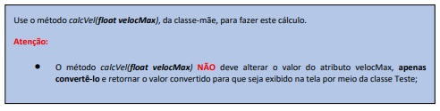
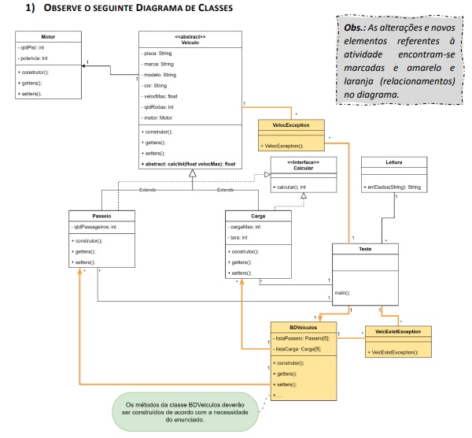
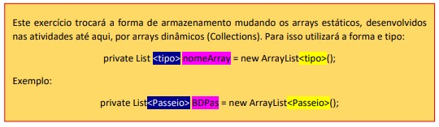
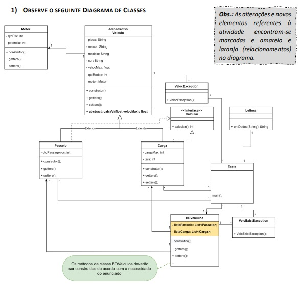
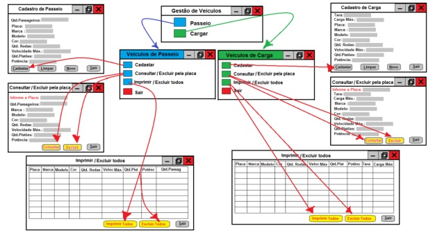
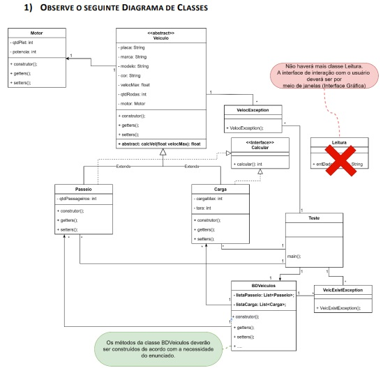

# ☕ Linguagem De Programação Java I..

## Este material foi desenvolvido em resposta a disciplina 'Java I', a qual faz parte do curso de Pós Graduação em Tecnologia Java, ministrado pela Universidade Tecnológica Federal do Paraná.
🎉 Os projetos, são exercícios solicitados ao longo do curso que juntos perfazem a nota que compõem a média final.

🥋 Se você está entrando no Java agora, vou deixar um comentário apenas para orientá-lo, caso considere o código destes exercícios estranho. São vários níveis de dificuldade, a medida que eles avançam, o grau de dificuldade os acompanha. Em especial, os últimos, foram considerados pelo professor e os demais colegas como os mais HARD, embora, tratar-se de um único projeto. Sem exageros e caso não entenda de primeira, continue tentando, pois, o sucesso não só reside nos melhores, más também, nos persistentes, que considero meu caso (_😎tirei nota máxima em quase todos_♻️rsrsrs). Desenvolver software, nada mais é que descartar a possibilidade de desistência (se for necessário, re-comece, quantas vezes precisar...), independente de qualquer motivo!

## Entregas..

✏️ Atividade 01: Desenvolver uma aplicação em linguagem Java, respeitando o que se pede:

👨‍💻 Requisitos:

    👉 a. Todos os métodos construtores default (que não possuem parâmetros formais em sua assinatura) deverão iniciar com 0 (zeros) atributos que sejam de tipos numerais (int, double, float, etc.) e com  espaço em branco (“ “) aqueles que forem de tipo literais (char, String e etc).

    👉 b. A classe “Teste” deve ser construída de forma a testar todas as funcionalidades do programa. Nesta deverão ser implementadas as entradas de dados e a impressão destes na tela. Por meio dela  deverá ser possível instanciar 5 veículos.

    👉 c. Perceba que, de acordo com as associações descritas no diagrama de classes e suas cardinalidades, a classe “Teste” irá conter apenas objetos do tipo “Veiculo”. Em momento nenhum deverá conter  objetos do tipo Motor. No entanto deverá, por meio de um objeto do tipo Veiculo, instanciar os atributos do objeto atributo motor, contido na classe Veiculo, que é do tipo Motor.

    👉 d. Perceba que a classe Veículo POSSUI um atributo do tipo Motor.
  
🕵️ Orientações adicionais:


✏️ Atividade 03: Embora a Atividade 3 trate do conceito e aplicação do mecanismo de Herança, ela também pode nos ajudar compreender a realidade das empresas e instituições que buscam intensificar o uso de  padrões de projetos desenvolvidos, de maneira ad hoc, por elas mesmas, com intuito de padronizar a construção de seus softwares. Por exemplo, ao definir-se como "final" um método "set", indicando que não  poderá ser sobrescrito, garantimos a perpetuação de uma regra de negócio restritiva sobre as características possíveis de um objeto (um atributo deste), como quando não queremos que um atributo receba um  valor fora de uma escala prevista.

👨‍💻 Requisitos: Desenvolva novos elementos a partir da Atividade 01

    👉 a. A “entrada” da velocidade (atributo velocMax) sempre será dada em km/h porém, a exibição destes dados ocorrerá na classe Teste e da seguinte forma:
        i. A velocidade do veículo de passeio deverá ser calculada em m/h. 1 kilometer/hour = 1000 meter/hour
        ii. A velocidade do veículo de carga deverá ser calculada em cm/h. 1 kilometer/hour = 100000 centimeter/hour


    👉 b. Os métodos construtores default deverão iniciar com 0 (zeros) atributos que sejam de tipos numerais (int, double, float, etc.) e com espaço em branco os que forem de tipo literais (char, String e  etc.)

    👉 c. Garanta que nunca ocorra:
        i. As classes Passeio e Carga jamais deverão ser estendidas (herdadas);
        ii. Nenhum método “set” poderá ser sobrescrito;

    👉 d. A classe “Teste” deve ser construída de forma a testar todas as funcionalidades do programa (entrada, saída e cálculos), propiciando assim “trocas de mensagens” entre os objetos das classes  Teste→Passeio e Teste→Carga. Por meio dela deverá ser possível instanciar 5 veículos de cada tipo (Passeio/Carga).
  
🕵️ Orientações adicionais: Novos elementos encontram-se em amarelo


✏️ Atividade 04: Herança Múltipla - Existem linguagens de programação que suportam, entretanto, não é o caso do Java. Para resolver esta situação, em Java, desenvolveu-se uma estrutura de dados denominada Interface

👨‍💻 Requisitos:

    👉 a. Proceguindo com a atividade 03, A classe Teste deverá conter o Menu Inicial com as seguintes opções (e suas funcionalidade desenvolvidas):
    
        Observações sobre as opções do Menu Inicial:
            • Opções 5 e 6: O usuário informa a placa do veículo e o programa deve executar uma busca no vetor do respectivo tipo de veículo e imprimir os dados deste;
            • Opção 7: o sistema será encerrado apenas quando o usuário escolher esta opção.
            
    👉 O Sistema deverá permitir:
        a. A cada operação realizada no sistema, este retornará ao Menu Inicial;
        b. Armazenar 5 de veículos de cada tipo. Crie 2 vetores, um para os veículos de passeio e outro para os de carga;
        c. Ao inserir um novo veículo o sistema deverá verificar se já existe um veículo cadastrado com a mesma placa. Caso exista, deverá informar ao usuário sobre esta existência e deverá voltar ao Menu
        Inicial.
        d. Ao final do cadastro de cada veículo, deverá ser perguntado se deseja cadastrar mais um (do mesmo tipo), caso a resposta seja NÃO deverá voltar ao Menu Inicial;
        e. A velocidade de cada veículo sempre será armazenada em Km/h, porém o método abstrato calcVel (sobrescrito nas classes Passeio e Carga) deverá calcular (não alterando o valor do atributo
        velocMax) e  retornar o resultado da seguinte forma: se o veículo for de passeio, deverá converter de Km/h para M/h (metros por hora) e retornar este valor. 1 kilometer/hour = 1000 meter/hour
    
    Sistema de Gestão de Veículos - Menu Inicial
        1. Cadastrar Veículo de Passeio
        2. Cadastrar Veículo de Carga
        3. Imprimir Todos os Veículos de Passeio
        4. Imprimir Todos os Veículos de Carga
        5. Imprimir Veículo de Passeio pela Placa
        6. Imprimir Veículo de Carga pela Placa
        7. Sair do Sistema

    Observações sobre as opções do Menu Inicial:
        • Opções 5 e 6: O usuário informa a placa do veículo e o programa deve executar uma busca no vetor do respectivo tipo de veículo e imprimir os dados deste;
        • Opção 7: o sistema será encerrado apenas quando o usuário escolher esta opção.

        - O Sistema deverá permitir: 
            a. A cada operação realizada no sistema, este retornará ao Menu Inicial;
            b. Armazenar 5 de veículos de cada tipo. Crie 2 vetores, um para os veículos de passeio e outro para os de carga;
            c. Ao inserir um novo veículo o sistema deverá verificar se já existe um veículo cadastrado com a mesma placa. Caso exista, deverá informar ao usuário sobre esta existência e deverá voltar ao
            Menu Inicial.
            d. Ao final do cadastro de cada veículo, deverá ser perguntado se deseja cadastrar mais um (do mesmo tipo), caso a resposta seja NÃO deverá voltar ao Menu Inicial; 
            e. A velocidade de cada veículo sempre será armazenada em Km/h, porém o método abstrato calcVel (sobrescrito nas classes Passeio e Carga) deverá calcular (não alterando o valor do atributo
            velocMax) e retornar o resultado da seguinte forma: se o veículo for de passeio, deverá converter de Km/h para M/h (metros por hora) e retornar este valor: 1 kilometer/hour = 1000 meter/hour;
            f. Caso seja de carga, converterá de Km/h para Cm/h (centímetros por hora) e retornar este valor: 1 kilometer/hour = 100000 centimeter/hour;



        f. Sempre que se optar pela opção 5 ou pela 6 do Menu Inicial, estes valores serão apresentados junto com as demais informações do respectivo veículo;
        g. O método “calcular” da interface “Calc”, quando sobrescrito:
            i. Na classe Passeio: retornará a soma das quantidades de letras existentes em todos os atributos do tipo String;
            ii. Na classe Carga: retornará a soma de todos os valores contidos nos atributos numéricos.
        h. Perceba que, pelo diagrama não há uma associação entre as classes Veículo e Teste nem entre Motor e Teste. Não poderá ser declarado um objeto do tipo Motor nas classes: Passeio, Carga e Teste.
        Somente haverá declaração na classemãe Veiculo;
            i. Todas entradas e saídas de dados deverão ser feitas na classe Teste:
                i. Entrada de dados: utilize o método entDados da classe Leitura;
                ii. Saídas: como achar melhor, porém deve imprimir os dados na mesma sequência dos atributos da classe-mãe Veiculo e depois destes os resultados dos métodos “calcular” e “calcVel”;  
                
🕵️ Orientações adicionais:


✏️ Atividade 06: Exceções - Desenvolver uma aplicação em linguagem Java, respeitando o que se pede:

👨‍💻 Requisitos: A classe Teste deverá conter o Menu Inicial com as seguintes opções (e suas funcionalidade desenvolvidas):

    👉 a. Sistema de Gestão de Veículos - Menu Inicial
        1. Cadastrar Veículo de Passeio
        2. Cadastrar Veículo de Carga
        3. Imprimir Todos os Veículos de Passeio
        4. Imprimir Todos os Veículos de Carga
        5. Imprimir Veículo de Passeio pela Placa
        6. Imprimir Veículo de Carga pela Placa
        7. Sair do Sistema

    • Opções 5 e 6: O usuário informa a placa do veículo e o programa deve executar uma busca no vetor do respectivo tipo de veículo e imprimir os dados deste; Caso não exista um veículo com esta placa o
    sistema deve avisar o usuário e retornar ao Menu Inicial.
    • Opção 7: o sistema será encerrado apenas quando o usuário escolher esta opção.

    - O Sistema deverá:
        a. A cada operação realizada no sistema, este retornará ao Menu Inicial;
        b. Armazenar 5 de veículos de cada tipo. Crie 2 vetores, um para os veículos de passeio e outro para os de carga;
        c. Ao inserir um novo veículo o sistema deverá verificar se já existe um veículo cadastrado com a mesma placa. Caso exista, deverá:
            i. Disparar a exceção VeicExistException (que será do tipo verificada); 
            ii. Seu método construtor deverá informar ao usuário sobre esta existência (“Já existe um veículo com esta placa”);
            iii. Voltar ao Menu Inicial.
        d. Sobre a Velocidade Máxima dos veículos:
            i. Caso a velocidade máxima de um veículo seja menor que 80 ou maior 110, deverá disparar a exceção “VelocException” (que será do tipo verificada). Seu método construtor deverá informar que: “A
            velocidade máxima está fora dos limites brasileiros”.
            ii. Neste caso (após disparar a exceção), se estiver “tentando” atribuir velocidade para um carro de passeio, este deverá assumir 100 (Km/h para velocidade máxima) se for um veículo de carga
            assumirá 90 Km/h;
        e. Ao final do cadastro de cada veículo, deverá ser perguntado se deseja cadastrar mais um (do mesmo tipo), caso a resposta seja NÃO deverá voltar ao Menu Inicial. Caso a resposta seja SIM, 
        permitir uma nova inserção;
        f. A velocidade de cada veículo sempre será armazenada em Km/h, porém o método abstrato calcVel (sobrescrito nas classes Passeio e Carga) deverá calcular (não alterando o valor do atributo 
        velocMax) e retornar o resultado da seguinte forma:
            i. Se o veículo for de passeio, deverá converter de Km/h para M/h (metros por hora) e retornar este valor: 1 kilometer/hour = 1000 meter/hour
            ii. Caso seja de carga, converterá de Km/h para Cm/h (centímetros por hora) e retornar este valor: 1 kilometer/hour = 100000 centimeter/hour


        g. Sempre que se optar pela opção 5 ou pela 6 do Menu Inicial, estes valores serão apresentados junto com as demais informações do respectivo veículo;
        h. O método “calcular” da interface “Calc”, quando sobrescrito:
            i. Na classe Passeio: retornará a soma das quantidades de letras existentes em todos os atributos do tipo String;
            ii. Na classe Carga: retornará a soma de todos os valores contidos nos atributos numéricos.
        i. Perceba que, pelo diagrama não há uma associação entre as classes Veículo e Teste nem entre Motor e Teste. Não poderá ser declarado um objeto do tipo Motor nas classes: Passeio, Carga e Teste.
        Somente haverá declaração na classemãe Veiculo;
        j. Todas entradas e saídas de dados deverão ser feitas na classe Teste: 
            i. Entrada de dados: utilize o método entDados da classe Leitura;
            ii. Saídas: como achar melhor, porém deve imprimir os dados na mesma sequência dos atributos da classe-mãe Veiculo e depois destes os resultados dos métodos “calcular” e “calcVel”;        
             
🕵️ Orientações adicionais:



✏️ Atividade 07: Collections - Desenvolver uma aplicação em linguagem Java, respeitando o que se pede:

👨‍💻 Requisitos:

    👉 a. A classe Teste deverá conter o Menu Inicial com as seguintes opções (e suas funcionalidade desenvolvidas):
        Sistema de Gestão de Veículos - Menu Inicial
            1. Cadastrar Veículo de Passeio
            2. Cadastrar Veículo de Carga
            3. Imprimir Todos os Veículos de Passeio
            4. Imprimir Todos os Veículos de Carga
            5. Imprimir Veículo de Passeio pela Placa
            6. Imprimir Veículo de Carga pela Placa
            7. Excluir Veículo de Passeio pela Placa
            8. Excluir Veículo de Carga pela Placa
            9. Sair do Sistema



    Opções 5 e 6: O usuário informa a placa do veículo e o programa deve executar uma busca no vetor do respectivo tipo de veículo e imprimir os dados deste; Caso não exista um veículo com esta placa o
    sistema deve avisar o usuário e retornar ao Menu Inicial. 
    • Opções 7 e 8: O usuário informa a placa do veículo; o programa executa uma busca no vetor do respectivo tipo de veículo e o EXCLUI. Caso não exista um veículo com esta placa, o sistema deve avisar o
    usuário e retornar ao Menu Inicial. 
    • Opção 9: o sistema será encerrado apenas quando o usuário escolher esta opção.

    - O Sistema deverá:
        a. A cada operação realizada no sistema, este retornará ao Menu Inicial;
        b. Armazenar uma quantidade indefinida de veículos de cada tipo. Crie (na classe BDVeiculo) 2 arrays dinâmicos, um para os veículos de passeio e outro para os de carga;
        c. Ao inserir um novo veículo o sistema deverá verificar se já existe um veículo cadastrado com a mesma placa. Caso exista, deverá:
            i. Disparar a exceção VeicExistException (que será do tipo verificada);
            ii. Seu método construtor deverá informar ao usuário sobre esta existência (“Já existe um veículo com esta placa”);
            iii. Voltar ao Menu Inicial.
        d. Sobre a Velocidade Máxima dos veículos:
            i. Caso a velocidade máxima de um veículo seja menor que 80 ou maior 110, deverá disparar a exceção “VelocException” (que será do tipo verificada). Seu método construtor deverá informar que: “A
        velocidade máxima está fora dos limites brasileiros”.
            ii. Neste caso (após disparar a exceção), se estiver “tentando” atribuir velocidade para um carro de passeio, este deverá assumir 100 (Km/h para velocidade máxima) se for um veículo de carga
            assumirá 90 Km/h;
        e. Ao final do cadastro de cada veículo, deverá ser perguntado se deseja cadastrar mais um (do mesmo tipo), caso a resposta seja NÃO deverá voltar ao Menu Inicial. Caso a resposta seja SIM, 
        permitir uma nova inserção; 
        f. A velocidade de cada veículo sempre será armazenada em Km/h, porém o método abstrato calcVel (sobrescrito nas classes Passeio e Carga) deverá calcular (não alterando o valor do atributo 
        velocMax) e retornar o resultado da seguinte forma: 
            i. Se o veículo for de passeio, deverá converter de Km/h para M/h (metros por hora) e retornar este valor: 1 kilometer/hour = 1000 meter/hour
            ii. Caso seja de carga, converterá de Km/h para Cm/h (centímetros por hora) e retornar este valor: 1 kilometer/hour = 100000 centimeter/hour


        
        g. Sempre que se optar pela opção 5 ou pela 6 do Menu Inicial, estes valores serão apresentados junto com as demais informações do respectivo veículo;
        h. O método “calcular” da interface “Calc”, quando sobrescrito:
            i. Na classe Passeio: retornará a soma das quantidades de letras existentes em todos os atributos do tipo String;
            ii. Na classe Carga: retornará a soma de todos os valores contidos nos atributos numéricos.
            i. Perceba que, pelo diagrama não há uma associação entre as classes Veículo e Teste nem entre Motor e Teste. Não poderá ser declarado um objeto do tipo Motor nas classes: Passeio, Carga e
            Teste. Somente haverá declaração na classemãe Veiculo;
            j. Todas entradas e saídas de dados deverão ser feitas na classe Teste:
                i. Entrada de dados: utilize o método entDados da classe;
                ii. Saídas: como achar melhor, porém deve imprimir os dados na mesma sequência dos atributos da classe-mãe Veiculo e depois destes os resultados dos métodos “calcular” e “calcVel”;
            
        - Restrições 
            a. Além dos métodos já explicitados, poderão criar outros que realmente sejam necessários;
            b. Não permita:
                i. Que seja possível instanciar objetos diretos da classe mãe (Veiculo);
                ii. Sobrescrevam os métodos setters da classe Veiculo;
                iii. Sobrescrevam os métodos das classes filhas (Passeio e Carga);
                iv. Que as classes filhas (Passeio e Carga) sejam herdadas;


🕵️ Orientações adicionais:



✏️ Atividade 08: Interface Gráfica - Desenvolver uma aplicação em linguagem Java, respeitando o que se pede:

👨‍💻 Requisitos: 

    👉 a. Utilize o sistema já foi desenvolvido na Atividade 07 e faça as adaptações necessárias a fim de provê-lo com Interface Gráfica;
    👉 b. Não deve utilizar as janelas e componentes já prontos de uma IDE (NetBeans, Eclipse e etc.). Deverá construir estas estruturas manualmente, codificando-as;
    👉 c. Sempre que acionar um botão “Sair” deverá retornar à janela anterior;

Sugestções: 
    - Não se preocupe com a estética: posicionamento, cores e efeitos dos componentes. Preocupe-se apenas em apresentar os itens de forma clara e legível. Foque nas funcionalidades. 
    - As janelas “Imprimir/Excluir todos” tanto de Passeio quanto de Carga, devem conter um componente capaz de conter um conjunto de objetos. No caso aconselha-se a usar uma tabela (JTable), mas poderia
    ser uma Lista (JList/JPanel) ou um caixa do tipo Combo (JComboBox).

🎯 Aplicação:


  
🕵️ Orientações adicionais:




### 📽️ Click na imagem e assista ao vídeo de apresentação do Projeto..     

[](https://www.youtube.com/watch?v=OBkI7t673lo)

# Tecnologia utilizada:


## Tabela de Conteúdos

- [Instalação](#Instalação)
- [Uso](#Uso)
- [Contribuição](#Contribuição)

## Instalação

1. Clone o repositório ou baixe o arquivo .zip:

```bash
git clone https://github.com/alfecjo/java_I.git
```
## Uso

1. Execute em sua IDE de preferência. Contudo, o desenvolvimento foi feito no IntelliJ! Você pode começar com: "mvn install", no diretório raiz, que é onde se encontra o
   arquivo pom.xml. Desta forma, serão baixadas as dependências, caso seja necessário.

## Contribuição

Contribuições são bem-vindas! Se você encontrar algum problema ou tiver sugestões de melhorias, abra um problema ou envie uma solicitação pull ao repositório.

Ao contribuir para este projeto, siga o estilo de código existente, [convenções de commit](https://www.conventionalcommits.org/en/v1.0.0/), e envie suas alterações em um branch separado.

Muito obrigado!!

---

- ## Return
  [](https://github.com/alfecjo/java-spring-testes/tree/main)
